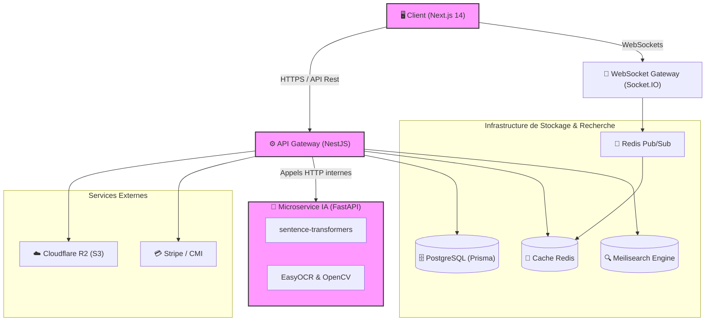

# 🌐 Communium Platform — Présentation Technique Globale

> **Plateforme de Réseautage Professionnel et de Commerce pour le Maroc** — Architecture Monorepo Full-Stack.
> Intègre un réseau d'affaires B2B/B2C, une marketplace avec enchères en temps réel, un module de mentorat, des réunions WebRTC et une gestion de tokens d'activité, le tout propulsé par un microservice d'IA local autonome.

---

## 📁 Structure du Projet (Monorepo)

Le projet utilise une architecture de monorepo gérée avec **pnpm** et **Turborepo** pour orchestrer le build et le développement des différentes applications et packages partagés.

```
the-communium/
├── apps/
│   ├── frontend/                       ← Application cliente Next.js 14 (App Router)
│   │   ├── src/
│   │   │   ├── app/                    ← Pages et routes du portail (auth, dashboard, onboarding)
│   │   │   ├── components/             ← Composants UI (marketplace, groups, mentorship, layout)
│   │   │   ├── hooks/                  ← Hooks TanStack Query par domaine métier
│   │   │   ├── lib/                    ← Client API, configuration NextAuth, utilitaires
│   │   │   └── types/                  ← Définitions de types TypeScript centralisées
│   ├── backend/                        ← API modulaire NestJS
│   │   ├── src/
│   │   │   ├── main.ts                 ← Point d'entrée de l'application NestJS
│   │   │   ├── app.module.ts           ← Module racine chargeant les 40+ modules
│   │   │   ├── ai/                     ← Client HTTP pour communiquer avec le service IA
│   │   │   ├── marketplace/            ← Gestion des annonces et analyses sémantiques
│   │   │   ├── auctions/               ← Moteur d'enchères et gestion des offres en direct
│   │   │   ├── mentorship/             ← Profils mentors, matching et planification de sessions
│   │   │   ├── groups/                 ← Flux d'activités, posts, likes et passerelle Socket.IO
│   │   │   ├── kyc/                    ← Traitement des documents et processus de validation
│   │   │   ├── tokens/                 ← Gestion du portefeuille de tokens Tks
│   │   │   └── redis/                  ← Module cache et client Pub/Sub
│   └── ai-service/                     ← Microservice d'IA en Python (FastAPI)
├── packages/
│   ├── database/                       ← Gestion du stockage de données persistant
│   │   ├── prisma/
│   │   │   └── schema.prisma           ← Schéma de base de données relationnel (50+ modèles)
│   │   └── seed.ts                     ← Script d'initialisation des données de test
│   └── shared/                         ← Types et utilitaires partagés entre frontend et backend
├── docker-compose.yml                  ← Services d'infrastructure (PostgreSQL, Redis, Meilisearch)
├── turbo.json                          ← Configuration des pipelines de build Turborepo
└── package.json                        ← Dépendances globales et scripts du monorepo
```

---

## ⚙️ Stack Technique Globale

| Couche | Technologie principale | Rôle et justification |
| :--- | :--- | :--- |
| **Frontend** | **Next.js 14 (App Router)** | Rendu hybride (SSR/ISR/CSR), optimisation SEO et routage robuste. |
| **Styling** | **Tailwind CSS + shadcn/ui** | Conception d'interfaces modulaires, réactives et thématisées (sombre/clair). |
| **Gestion d'état** | **TanStack Query v5** | Synchronisation de l'état serveur, mise en cache et requêtes optimistes. |
| **Backend** | **NestJS (V10)** | Architecture modulaire, injection de dépendances, robustesse et typage strict. |
| **Base de données** | **PostgreSQL 16** | Stockage relationnel transactionnel et intégrité référentielle. |
| **Accès aux données** | **Prisma ORM** | Requêtes typées, migrations de schéma structurées et synchronisation du client. |
| **Cache & Pub/Sub** | **Redis 7** | Cache de performance, gestion des sessions et canal de diffusion temps réel. |
| **Moteur de recherche**| **Meilisearch** | Recherche textuelle rapide avec tolérance aux fautes et facettes. |
| **Microservice IA** | **FastAPI + PyTorch** | Exécution locale de modèles NLP (Sentence-Transformers) et Vision (EasyOCR). |
| **Communication Temps Réel**| **Socket.IO** | Connexions bidirectionnelles persistantes pour le tchat et les enchères. |
| **Communications Web** | **WebRTC** | Établissement de liaisons peer-to-peer pour les réunions de groupe en direct. |
| **Stockage Fichiers** | **Cloudflare R2 (S3 API)**| Stockage d'images de produits, d'avatars et de documents KYC. |
| **Paiements** | **Stripe + CMI** | Transactions bancaires internationales et nationales (Maroc). |
| **Envoi d'e-mails** | **Resend** | Notifications transactionnelles et alertes par e-mail. |

---

## 🏗️ Architecture Globale et Interactions

Le diagramme suivant illustre le flux de communication et l'intégration des différents services au sein de la plateforme :



---

## 🗄️ Modèle de Données et Schéma Prisma

Le fichier [schema.prisma](file:///c:/Users/PC/Desktop/THE-COMMUNIUM-main/packages/database/prisma/schema.prisma) définit plus de 50 modèles, structurés en phases progressives. Voici les relations fondamentales de la plateforme :

### 1. Gestion des Utilisateurs et KYC
* **`User`** : Entité centrale contenant les informations d'authentification (compatible NextAuth/Clerk), le type de compte (`personal`, `business`, `company_creation`), et le rôle (`USER`, `ADMIN`, `MODERATOR`).
* **`Kyc`** : Gère la vérification d'identité. Pour les particuliers, il référence les fichiers de la Carte d'Identité Nationale (`cinFrontUrl`, `cinBackUrl`) et un `selfieUrl`. Pour les entreprises, il stocke le Registre de Commerce (`rcUrl`), le certificat de taxe (`taxCertUrl`) et les informations du représentant légal.
* **`PersonalProfile` & `BusinessProfile`** : Profils enrichis contenant des champs hautement qualifiés (historique de travail, compétences techniques, équipement technique, ressources humaines, secteurs d'intérêt).

### 2. Marketplace et Enchères (Phase 2)
* **`Category`** : Structure hiérarchique avec relations parent-enfant pour organiser les produits.
* **`Listing`** : Annonce de produit ou service. Comprend le prix, la devise (défaut `MAD`), l'état de l'objet (`new`, `like_new`, `good`, `fair`), la localisation et une liaison vers un enregistrement vectoriel (`ListingEmbedding`).
* **`Auction`** : Configure une vente aux enchères liée à un `Listing`. Définit le prix de départ, le prix de réserve optionnel, le prix courant, le pas d'enchère minimal (`minIncrement`) et les fenêtres temporelles (`startTime`, `endTime`).
* **`Bid`** : Enregistre chaque offre soumise pour une enchère, avec un drapeau `isWinning` indiquant si l'offre est actuellement la plus élevée.

### 3. Mentorat et Réseau (Phase 3 & 5)
* **`MentorProfile`** : Étend un utilisateur avec son expertise, son tarif horaire en jetons `Tks`, sa notation moyenne et ses disponibilités.
* **`MentorshipRequest`** : Demande de mentorat soumise par un mentoré avec ses objectifs.
* **`MentorshipSession`** : Session planifiée de mentorat, intégrant l'URL de réunion en ligne, le coût en tokens d'activité, et le statut (`SCHEDULED`, `COMPLETED`, `CANCELED`).
* **`Group` & `GroupPost`** : Communautés thématiques de professionnels avec flux de publications, commentaires, mentions et réactions.

---

## ⚡ Architecture Temps Réel et Messagerie

Le temps réel est un pilier essentiel pour les fonctionnalités d'enchères, de messagerie directe/groupe et de flux d'actualités. 

```
┌──────────────┐             ┌──────────────┐             ┌──────────────┐
│  Navigateur  │  WebSocket  │ Serveur Nest │  Pub / Sub  │  Instance 2  │
│   Client A   ├────────────►│  (Node.js)   ├────────────►│  (Cluster)   │
└──────────────┘             └──────┬───────┘             └──────┬───────┘
                                    │                            │
                                    ▼                            ▼
                             ┌──────────────┐             ┌──────────────┐
                             │  Redis Core  │             │  Navigateur  │
                             │ (Bases clés) │             │   Client B   │
                             └──────────────┘             └──────────────┘
```

1. **Diffusion d'Enchères en Direct** : Lorsqu'un utilisateur soumet une offre via l'endpoint `/auctions/:id/bid`, le serveur valide l'offre en base de données, met à jour le prix courant de l'enchère, puis publie l'événement sur le canal Redis Pub/Sub. La passerelle Socket.IO intercepte l'événement et le diffuse instantanément à tous les clients connectés à la salle de l'enchère spécifique (`auction:<id>`).
2. **Messagerie instantanée** : Implémentée à l'aide de salles privées Socket.IO. Les accusés de réception de lecture (`MessageReadReceipt`) et les notifications d'écriture sont gérés via des événements bidirectionnels asynchrones à faible latence.
3. **Flux de Groupe (Likes & Commentaires)** : Pour éviter les requêtes régulières (polling), les actions sur les posts de groupes sont publiées sur les canaux Redis `group:likes` et `group:comments`. Le serveur diffuse ces modifications aux membres connectés pour rafraîchir l'interface client de manière transparente.

---

## 🛡️ KYC, Sécurité et Traitement CNIE

Le processus d'inscription et de certification des comptes professionnels repose sur un pipeline automatisé de traitement de documents :

```
[Photo de CNIE] ──► Upload R2 ──► Requête NestJS ──► [FastAPI CV Engine]
                                                           │
                                                    (OpenCV Warp)
                                                           │
                                                    (EasyOCR Parse)
                                                           │
[Profil Vérifié] ◄── Validation Métier ◄── Extraction Regex ◄─┘
```

1. **Téléversement Sécurisé** : L'utilisateur téléverse la photo de sa Carte Nationale d'Identité Électronique (CNIE) marocaine sur Cloudflare R2 via des URLs présignées générées par NestJS.
2. **Analyse de Forme par Vision Industrielle** : L'image est transmise au microservice FastAPI. Le module `cnie_extractor.py` applique un traitement d'image avancé (filtre CLAHE, seuillage adaptatif d'Otsu, détection de contours de Canny). Il recherche un contour rectangulaire ayant un ratio d'aspect proche de **1.586** (norme ISO/IEC 7810 ID-1 pour les cartes d'identité). Si ce contour est identifié, l'image est redressée (perspective warp) pour faciliter la lecture.
3. **OCR et Extraction de Texte** : L'OCR EasyOCR (configuré pour l'arabe et le français) extrait le texte brut. Des expressions régulières robustes localisent le numéro de CIN (par exemple, une ou deux lettres suivies de 5 à 8 chiffres) et les dates clés.
4. **Validation et Fallback** : Les informations (nom, prénom, date et lieu de naissance, adresse) sont renvoyées sous forme structurée à NestJS. Si la détection géométrique échoue, le service effectue un traitement en texte brut global (fallback) pour maximiser le taux de réussite.

---

## 🪙 Économie Interne : Jetons Tks et Portefeuille

La plateforme intègre une économie interne matérialisée par les jetons **Tks** (Tokens Communium), qui récompensent l'engagement et financent les interactions professionnelles :

* **Wallet Utilisateur (`TksWallet`)** : Chaque utilisateur dispose d'un portefeuille affichant son solde actuel, le total des jetons gagnés et le total dépensé.
* **Transactions Historisées (`TksTransaction`)** : Toute modification du solde génère un enregistrement comptable inaltérable indiquant le montant (positif pour les gains, négatif pour les dépenses), le type et la raison de la transaction.
* **Cas d'Utilisation** :
  * **Mentorat** : Les mentors fixent un tarif horaire en jetons Tks. Lorsqu'une session est complétée, les jetons sont transférés du portefeuille du mentoré vers celui du mentor (gestion par séquestre temporaire lors de la réservation).
  * **Création d'entreprise** : L'accès à certains outils d'aide à la création d'entreprise ou à la rédaction de statuts juridiques est facturé en jetons Tks.
  * **Récompenses de contribution** : La publication d'articles de blog populaires dans les forums, le parrainage ou la validation de profils KYC peuvent donner lieu à des attributions automatiques de jetons par la plateforme.

---

## 🤖 Intégration et Synergie IA

Le backend NestJS utilise un client HTTP dédié pour consommer les services d'intelligence artificielle locale hébergés sur le port `8000`. Cette séparation physique garantit que le service d'IA n'interagit jamais directement avec la base de données PostgreSQL, préservant ainsi la sécurité et la modularité.

Voici comment le serveur NestJS intègre les 10 endpoints du service IA :

```
┌───────────────────────────────┐
│     NestJS (Application)      │
└──────────────┬────────────────┘
               │ (Requêtes HTTP internes)
               ▼
┌───────────────────────────────┐
│     FastAPI (AI Service)      │
│  - Modèle : MiniLM-L12-v2     │
│  - Traitement local (Docker)  │
└───────────────────────────────┘
```

### Synthèse des Interactions Backend / IA

1. **Recommandations Métier** : Lors de la consultation de la page d'accueil ou d'une catégorie, le backend envoie l'historique d'activité de l'utilisateur à l'endpoint `/recommendations/suggest` qui applique l'algorithme MMR (Maximal Marginal Relevance) pour lui présenter des annonces ciblées et diversifiées.
2. **Recherche de Similarité Sémantique** : Lors de l'affichage d'un produit, NestJS interroge `/similarity/listings` pour obtenir les 5 articles les plus proches sémantiquement, sans se limiter à une recherche stricte par mots-clés.
3. **Mise en Relation Mentorat** : Le module de mentorat soumet le profil d'un mentoré à l'endpoint `/mentors/match` qui calcule un score composite basé à 55% sur la similarité sémantique des expertises, et à 45% sur des facteurs de qualité (notes, expérience, volume d'activité).
4. **Modération et Analyse des Avis** : Les commentaires rédigés sur le site sont envoyés à `/sentiment/analyze`. Les commentaires détectés comme négatifs ou suspects sont automatiquement signalés dans le tableau de bord de modération.
5. **Prévention de l'Attrition (Churn)** : Un job planifié quotidien (cron job) analyse les signaux d'activité des utilisateurs et appelle `/churn/predict` pour identifier les clients à risque et déclencher des campagnes de fidélisation automatiques.

---

## 🚀 Guide de Démarrage et Configuration Réseau (LAN)

### 1. Lancement de l'Infrastructure et des Services

Assurez-vous d'avoir installé **Node.js (v20+)**, **pnpm** et **Docker**.

```bash
# 1. Cloner et installer les dépendances
cd the-communium
pnpm install

# 2. Lancer les bases de données, Redis, Meilisearch et le service IA
docker-compose up -d

# 3. Appliquer les migrations de base de données PostgreSQL
pnpm db:push

# 4. Initialiser la base de données avec les données de test
pnpm db:seed

# 5. Démarrer toutes les applications en mode développement
pnpm dev
```

### 2. Configuration pour Tests Multidispositifs (Partage LAN)

Pour tester les fonctionnalités en temps réel (WebRTC et WebSockets) sur des appareils mobiles connectés au même réseau local, configurez les variables d'environnement avec l'adresse IP locale de votre machine hôte (ex: `192.168.1.50`) :

* Dans le fichier **`apps/frontend/.env`** :
  ```env
  NEXTAUTH_URL=http://192.168.1.50:3000
  NEXT_PUBLIC_API_URL=http://192.168.1.50:4000/api
  NEXT_PUBLIC_WS_URL=http://192.168.1.50:4000
  ```

* Dans le fichier **`apps/backend/.env`** (ou fichier `.env` à la racine) :
  ```env
  FRONTEND_URL=http://192.168.1.50:3000
  ```

Le serveur de développement de Next.js étant configuré pour écouter sur toutes les interfaces réseau (`0.0.0.0`), l'application sera instantanément accessible depuis n'importe quel smartphone ou tablette du réseau local à l'adresse `http://192.168.1.50:3000`.

---

## 🎓 Contexte PFE (Projet de Fin d'Études)

La plateforme *The Communium* a été développée dans le cadre d'un Projet de Fin d'Études en **Génie Data Science & Intelligence Artificielle** pour l'entreprise d'accueil **Hamri Capital**.

### Objectifs Scientifiques et Techniques Validés :
* **Conception d'une Architecture Hybride** : Découplage total entre le serveur d'application transactionnel (NestJS/PostgreSQL) et le moteur de calcul d'intelligence artificielle (FastAPI/PyTorch).
* **Valorisation de l'IA Locale (Edge AI)** : Exécution de modèles de traitement du langage naturel et de vision par ordinateur en local, garantissant une souveraineté des données utilisateurs et l'absence de coûts de facturation d'API tierces (modèle 100% autonome).
* **Économie Numérique Circulaire** : Simulation d'un écosystème de partage de compétences et de services professionnels basé sur une régulation par jetons d'activité et scoring sémantique.
